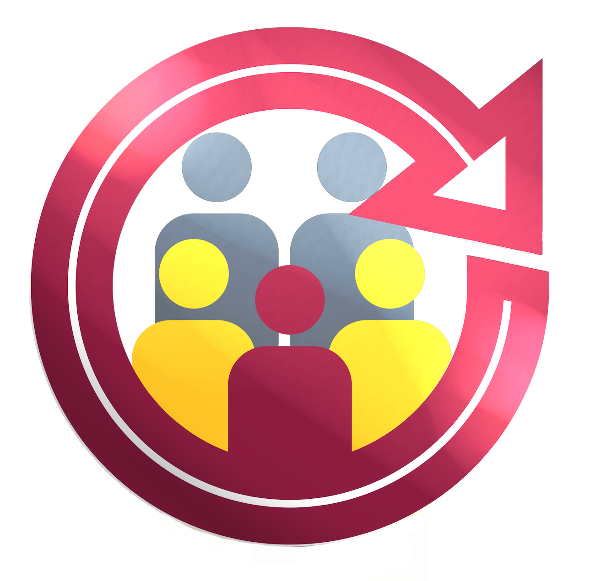

# ASU Capstone Team Assignment System




## Development Team

The Capstone Team Assignment System was developed by five ASU-online senior software engineering students during the Fall 2019 and Spring 2020 semesters. 
Our sponsor for this project was the software engineering ASU instructor, Mr.Douglas Sandy. 
The initial conception of the idea is also credited to Mr.Douglas Sandy

SOFTWARE TEAM 
@author(s) Elizabeth Marquise, Myles Colina, Sean Rogers, Cristi Deleo, Matthew Cilibraise

Copyright (C) 2020, ASU Capstone Project
All Rights Reserved

## General Information

This software application creates high-quality assignments of student teams to ASU Capstone projects. This automizes a previously manual task reducing the time to just minutes. The task of assigning teams to projects is an optimization problem of NP-hard complexity. The ‘brute force’ method of finding all possible combinations would arrive at the most optimal solution, but it would take more years than there are atoms in the universe! The software solution that the team has developed reduces this time to minutes, and provides excellent student teams to project matches. The invented algorithm is a cross between a binning and swapping algorithm, that takes into account the student's skills, among other factors, and matches them to projects based on the projects required skills. The algorithm focuses on the quality of the entire team, ensuring that students are assigned to teams that closely match their own skill level, and the skills required for the project.

This software application connects to Canvas, (the online course website for ASU), and preforms HTTP requests to collect the course and student roster information. The application can connect to Canvas by logging in the user using the ASU login, via a mini-browser window. The cookies are then stored and sent with subsequent HTTP requests to sustain the authenticated session.

The GUI (Graphical User Interface) was developed using FLTK, and the team has constructed two versions: an ASU version, and a Steampunk version.

As of 04/06/2020, the computational time for 4 class sections each with 120 students, and 100 projects is under 15 minutes, with the average runtime of 11 minutes.


### Technologies
This project is written in C++.

### Third-Party Libraries
This project utilizes third party software, namely: 
* JsonCPP, libcurl, fltk-1.3.5, gtk, webkit2, boost.

## Setup
To run this project, various installs are neccessary.
Clone it locally using git and use make commands to run the software once installed.
(all the steps are detailed below):

```
$ git clone https://github.com/SeanRog/SER401-FALL-19-Project35
$ cd ./SER401-FALL-19-Project35/BruteForce
$ chmod u+x install.sh
$ sudo ./install.sh
```
Fltk needs to be installed and configured.
(enter the following commands into the same terminal window).

```
cd ./include/fltk-1.3.5
./configure
sudo make
sudo make install
cd -
```

Finally make and run the program.

```
$ make clean
$ make
$ make run
```
